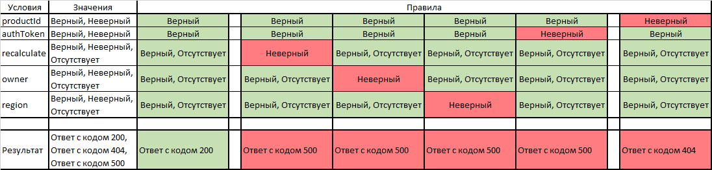

# Задача Т1. Написание тест-кейсов

## Условие задачи
- Реализовано REST API GET  
/products/{productId}/status?authToken=&recalculate=&owner=&region=

- Функция возвращает статус продукта, в качестве входных данных функция принимает следующие параметры  

| recalculate | owner        | region       |
|-------------|--------------|--------------| 
| true        | Создатель    | Северо-Запад |
| false       | Пользователь | Сибирь       |
| null        | null         | Поволжье     |

- Параметры необязательные (т.е. могут отсутствовать в запросе), параметры не коррелируют между собой.
- authToken - параметр авторизации и аутентификации, набор из 16 символов, включающие цифры и буквы.
- Функция возвращает ответ в json формате с http-кодом 200 { "productStatus": 1}  
Допустимые значения 1- Готов, 0 - Не готов
- В случае если продукт не найден возвращается ответ с кодом 404
- В случае ошибки http-код 500 с телом в формате json {"errorMessage": }

## Требуется
Составить план тестирования, описать проверяемые тест кейсы.

## Тест-кейсы
Для составления тест-кейсов используется таблица принятия решений:

### Тест-кейс 1. Попарное тестирование параметров recalculate, owner и region
Каждый из этих параметров может иметь одно из трех состояний: верный, неверный, отсутствует. Таблица попарного
тестирования параметров recalculate, owner и region выглядит следующим образом:  

<table>
    <tr>
        <td>№</td>
        <td>recalculate</td>
        <td>owner</td>
        <td>owner</td>
    </tr>
    <tr>
        <td>1</td>
        <td>Верный</td>
        <td>Верный</td>
        <td>Верный</td>
    </tr>
    <tr>
        <td>2</td>
        <td>Верный</td>
        <td>Отсутствует</td>
        <td>Отсутствует</td>
    </tr>
    <tr>
        <td>3</td>
        <td>Отсутствует</td>
        <td>Верный</td>
        <td>Отсутствует</td>
    </tr>
    <tr>
        <td>4</td>
        <td>Неверный</td>
        <td>Отсутствует</td>
        <td>Верный</td>
    </tr>
    <tr>
        <td>5</td>
        <td>Отсутствует</td>
        <td>Неверный</td>
        <td>Верный</td>
    </tr>
    <tr>
        <td>6</td>
        <td>Отсутствует</td>
        <td>Отсутствует</td>
        <td>Неверный</td>
    </tr>
    <tr>
        <td></td>
        <td></td>
        <td></td>
        <td></td>
    </tr>
    <tr>
        <td>7</td>
        <td>Верный</td>
        <td>Неверный</td>
        <td>Неверный</td>
    </tr>
    <tr>
        <td>8</td>
        <td>Неверный</td>
        <td>Неверный</td>
        <td>Отсутствует</td>
    </tr>
    <tr>
        <td>9</td>
        <td>Неверный</td>
        <td>Верный</td>
        <td>Неверный</td>
    </tr>
</table>

Полагая, что хотя бы один неверный параметр приведет к ошибке с кодом 500, можно убрать из таблицы проверки с
несколькими неверными параметрами (выделены красным). В таком случае таблица попарного тестирования параметров 
recalculate, owner и region выглядит следующим образом:

<table>
    <tr>
        <td>№</td>
        <td>recalculate</td>
        <td>owner</td>
        <td>owner</td>
    </tr>
    <tr>
        <td>1</td>
        <td>Верный</td>
        <td>Верный</td>
        <td>Верный</td>
    </tr>
    <tr>
        <td>2</td>
        <td>Верный</td>
        <td>Отсутствует</td>
        <td>Отсутствует</td>
    </tr>
    <tr>
        <td>3</td>
        <td>Отсутствует</td>
        <td>Верный</td>
        <td>Отсутствует</td>
    </tr>
    <tr>
        <td>4</td>
        <td>Неверный</td>
        <td>Отсутствует</td>
        <td>Верный</td>
    </tr>
    <tr>
        <td>5</td>
        <td>Отсутствует</td>
        <td>Неверный</td>
        <td>Верный</td>
    </tr>
    <tr>
        <td>6</td>
        <td>Отсутствует</td>
        <td>Отсутствует</td>
        <td>Неверный</td>
    </tr>
</table>

[Реализация тест-кейса 1](Test-case_1.md)

### Тест-кейс 2. Тестирование параметра авторизации и аутентификации authToken
Согласно условию задачи, authToken - параметр авторизации и аутентификации, набор из 16 символов, включающие цифры и буквы.  
Используя метод граничных значений, необходимо проверить число и тип символов.  

Таблица попарного тестирования числа и типа символов параметра authToken выглядит следующим образом:

<table>
    <tr>
        <td>№</td>
        <td>Число символов</td>
        <td>Тип символов</td>
    </tr>
    <tr>
        <td>1</td>
        <td>16</td>
        <td>цифры и буквы</td>
    </tr>
    <tr>
        <td>2</td>
        <td>15</td>
        <td>цифры и буквы</td>
    </tr>
    <tr>
        <td>3</td>
        <td>16</td>
        <td>только цифры</td>
    </tr>
    <tr>
        <td>4</td>
        <td>16</td>
        <td>только буквы</td>
    </tr>
    <tr>
        <td>5</td>
        <td>17</td>
        <td>цифры и буквы</td>
    </tr>
    <tr>
        <td></td>
        <td></td>
        <td></td>
    </tr>
    <tr>
        <td>6</td>
        <td>15</td>
        <td>только цифры</td>
    </tr>
    <tr>
        <td>7</td>
        <td>15</td>
        <td>только буквы</td>
    </tr>
    <tr>
        <td>8</td>
        <td>17</td>
        <td>только буквы</td>
    </tr>
    <tr>
        <td>9</td>
        <td>17</td>
        <td>только цифры</td>
    </tr>
</table>

Полагая, что хотя бы одна неверная характеристика параметра authToken приведет к ошибке с кодом 500, можно убрать из 
таблицы проверки с несколькими неверными характеристиками (выделены красным). В таком случае таблица попарного 
тестирования числа и типа символов параметра authToken выглядит следующим образом:

<table>
    <tr>
        <td>№</td>
        <td>Число символов</td>
        <td>Тип символов</td>
    </tr>
    <tr>
        <td>1</td>
        <td>16</td>
        <td>цифры и буквы</td>
    </tr>
    <tr>
        <td>2</td>
        <td>15</td>
        <td>цифры и буквы</td>
    </tr>
    <tr>
        <td>3</td>
        <td>16</td>
        <td>только цифры</td>
    </tr>
    <tr>
        <td>4</td>
        <td>16</td>
        <td>только буквы</td>
    </tr>
    <tr>
        <td>5</td>
        <td>17</td>
        <td>цифры и буквы</td>
    </tr>
</table>

[Реализация тест-кейса 2](Test-case_2.md)

### Тест-кейс 3. Тестирование параметра productId
Согласно условию задачи, в случае если продукт не найден возвращается ответ с кодом 404. Необходимо проверить запрос
параметром productId несуществующего продукта.

[Реализация тест-кейса 3](Test-case_3.md)
