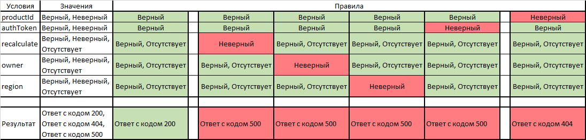

# Задача Т1. Написание тест-кейсов

## Условие задачи
- Реализовано REST API GET  
/products/{productId}/status?authToken=&recalculate=&owner=&region=

- Функция возвращает статус продукта, в качестве входных данных функция принимает следующие параметры  

| recalculate | owner        | region       |
|-------------|--------------|--------------| 
| true        | Создатель    | Северо-Запад |
| false       | Пользователь | Сибирь       |
| null        | null         | Поволжье     |

- Параметры необязательные (т.е. могут отсутствовать в запросе), параметры не коррелируют между собой.
- authToken - параметр авторизации и аутентификации, набор из 16 символов, включающие цифры и буквы.
- Функция возвращает ответ в json формате с http-кодом 200 { "productStatus": 1}  
Допустимые значения 1- Готов, 0 - Не готов
- В случае если продукт не найден возвращается ответ с кодом 404
- В случае ошибки http-код 500 с телом в формате json {"errorMessage": }

## Требуется
Составить план тестирования, описать проверяемые тест кейсы.

## Тест-кейсы
Для составления тест-кейсов используется таблица принятия решений:

### Тест-кейс 1. Попарное тестирование параметров recalculate, owner и region
Таблица попарного тестирования параметров recalculate, owner и region выглядит следующим образом (пустая ячейка в 
таблице означает отсутствие параметра в запросе):  

| №  | recalculate | owner        | region       |
|----|-------------|--------------|--------------|
| 1  | true        | Создатель    | Северо-Запад |
| 2  | true        |              |              |
| 3  |             | Создатель    |              |
| 4  | false       |              | Северо-Запад |
| 5  |             | Пользователь | Северо-Запад |
| 6  |             |              | Поволжье     |
| 7  | true        | Пользователь | Сибирь       |
| 8  | true        | null         | Поволжье     |
| 9  |             | null         | Сибирь       |
| 10 | false       | Создатель    | Сибирь       |
| 11 | null        | Создатель    | Поволжье     |
| 12 | null        |              | Сибирь       |
| 13 | null        | null         | Северо-Запад |
| 14 | null        | Пользователь |              |
| 15 | false       | null         |              |
| 16 | false       | Пользователь | Поволжье     |

Полагая, что хотя бы один неверный параметр приведет к ошибке с кодом 500, следует убрать из таблицы проверки с 
несколькими неверными параметрами.  

Для продукта c параметрами recalculate = true, owner = Создатель, region = Северо-Запад таблица попарного тестирования
параметров recalculate, owner и region выглядит следующим образом (пустая ячейка в таблице означает отсутствие параметра
в запросе):

<table>
    <tr>
        <td><b>№</b></td>
        <td><b>recalculate</b></td>
        <td><b>owner</b></td>
        <td><b>region</b></td>
        <td><b>Ожидаемый результат</b></td>
    </tr>
    <tr>
        <td>1</td>
        <td>true</td>
        <td>Создатель</td>
        <td>Северо-Запад</td>
        <td  rowspan="3">
            Ответ в json формате с http-кодом 200 {"productStatus": 1}  
            Допустимые значения 1- Готов, 0 - Не готов
        </td>
    </tr>
    <tr>
        <td>2</td>
        <td>true</td>
        <td></td>
        <td></td>
    </tr>
    <tr>
        <td>3</td>
        <td></td>
        <td>Создатель</td>
        <td></td>
    </tr>
    <tr>
        <td>4</td>
        <td>false</td>
        <td></td>
        <td>Северо-Запад</td>
        <td  rowspan="3">
            Ответ в json формате с http-кодом 500 {"errorMessage": }
        </td>
    </tr>
    <tr>
        <td>5</td>
        <td></td>
        <td>Пользователь</td>
        <td>Северо-Запад</td>
    </tr>
    <tr>
        <td>6</td>
        <td></td>
        <td></td>
        <td>Поволжье</td>
    </tr>
</table>

[Реализация тест-кейса 1](Test-case_1.md)

### Тест-кейс 2. Тестирование параметра авторизации и аутентификации authToken
Согласно условию задачи, authToken - параметр авторизации и аутентификации, набор из 16 символов, включающие цифры и буквы.  
Используя метод граничных значений, необходимо проверить число и тип (цифры и/или буквы) символов.

Таблица попарного тестирования числа и типа (цифры и/или буквы) символов параметра authToken выглядит следующим образом:

<table>
    <tr>
        <td><b>№</b></td>
        <td><b>Число символов</b></td>
        <td><b>Тип символов</b></td>
    </tr>
    <tr>
        <td>1</td>
        <td>16</td>
        <td>цифры и буквы</td>
    </tr>
    <tr>
        <td>2</td>
        <td>15</td>
        <td>цифры и буквы</td>
    </tr>
    <tr>
        <td>3</td>
        <td>16</td>
        <td>только цифры</td>
    </tr>
    <tr>
        <td>4</td>
        <td>16</td>
        <td>только буквы</td>
    </tr>
    <tr>
        <td>5</td>
        <td>17</td>
        <td>цифры и буквы</td>
    </tr>
    <tr>
        <td></td>
        <td></td>
        <td></td>
    </tr>
    <tr>
        <td>6</td>
        <td>15</td>
        <td>только цифры</td>
    </tr>
    <tr>
        <td>7</td>
        <td>15</td>
        <td>только буквы</td>
    </tr>
    <tr>
        <td>8</td>
        <td>17</td>
        <td>только буквы</td>
    </tr>
    <tr>
        <td>9</td>
        <td>17</td>
        <td>только цифры</td>
    </tr>
</table>

Полагая, что хотя бы одна неверная характеристика параметра authToken приведет к ошибке с кодом 500, можно убрать из 
таблицы проверки с несколькими неверными характеристиками (проверки 6-9). В таком случае таблица попарного 
тестирования числа и типа (цифры и/или буквы) символов параметра authToken выглядит следующим образом:

<table>
    <tr>
        <td><b>№</b></td>
        <td><b>Число символов</b></td>
        <td><b>Тип символов</b></td>
        <td><b>Ожидаемый результат</b></td>
    </tr>
    <tr>
        <td>1</td>
        <td>16</td>
        <td>цифры и буквы</td>
        <td>
            Ответ в json формате с http-кодом 200 {"productStatus": 1}  
            Допустимые значения 1- Готов, 0 - Не готов
        </td>
    </tr>
    <tr>
        <td>2</td>
        <td>15</td>
        <td>цифры и буквы</td>
        <td  rowspan="4">
            Ответ в json формате с http-кодом 500 {"errorMessage": }
        </td>
    </tr>
    <tr>
        <td>3</td>
        <td>16</td>
        <td>только цифры</td>
    </tr>
    <tr>
        <td>4</td>
        <td>16</td>
        <td>только буквы</td>
    </tr>
    <tr>
        <td>5</td>
        <td>17</td>
        <td>цифры и буквы</td>
    </tr>
</table>

Также, в качестве негативных тестов, необходимо проверить использование кириллицы и спецсимволов.

[Реализация тест-кейса 2](Test-case_2.md)

### Тест-кейс 3. Тестирование параметра productId
Согласно условию задачи, в случае если продукт не найден возвращается ответ с кодом 404. Необходимо проверить запрос
параметром productId несуществующего продукта.

[Реализация тест-кейса 3](Test-case_3.md)
