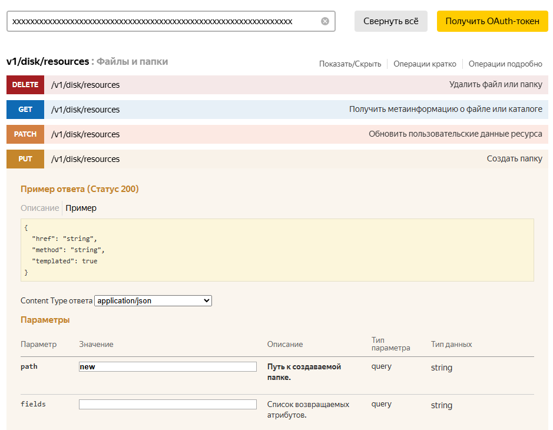
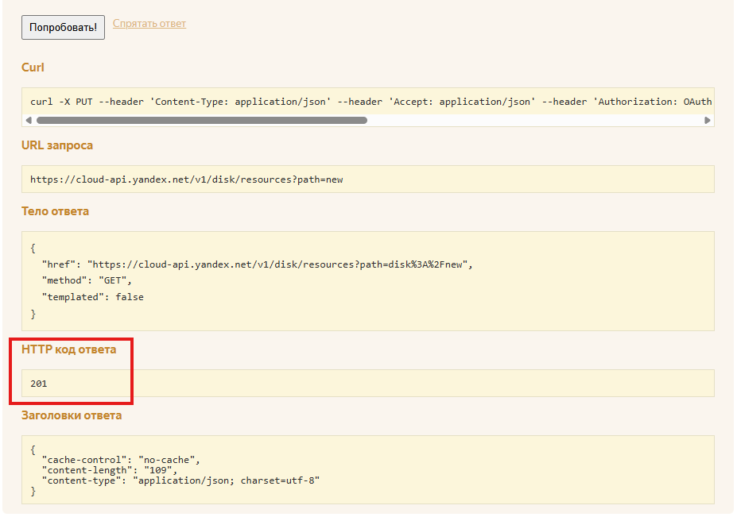

# Баг репорт 3. API. Несоответствие кода успешного выполнения запроса

## Автор: Макаров Вадим Михайлович

## Описание
В случае успешного выполнения запроса получен ответ, несоответствующий ожидаемому. 

### Предусловия
1. Открыть сваггер Яндекс.API (см. Окружение)
2. Получить OAuth-токен (подробнее в разделе "Получение OAuth-токенов" документации API Яндекс Диска  
https://yandex.ru/dev/disk-api/doc/ru/concepts/quickstart )

### Шаги воспроизведения
1. Выбрать запрос PUT v1/disk/resources
2. Выбрать Content Type ответа: application/json
3. Ввести уникальный путь (path) к создаваемой папке 
4. Нажать кнопку "Попробовать!"

### Ожидаемый результат
Ответ с кодом 200 (согласно требованиям)
### Фактический результат
Ответ с кодом 201

## Окружение
Браузер: "Google Chrome" v.136.0.7103.93  
Стенд: Prod  
Сваггер Яндекс.API https://yandex.ru/dev/disk/poligon/

## Серьезность
Major

## Вложения

