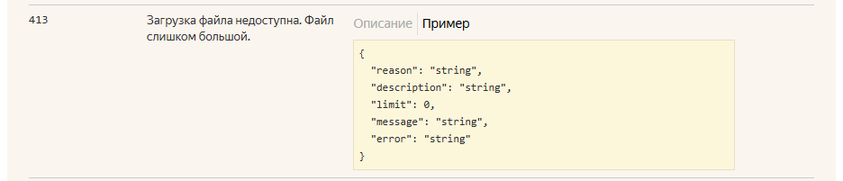

# Баг репорт 5. API. Несоответствие тела ответа с ошибкой 413

## Автор: Макаров Вадим Михайлович

## Описание
В случае ответа с кодом 413, тело ответа не соответствует ожидаемому.

### Предусловия
1. Открыть сваггер Яндекс.API (см. Окружение)

### Шаги воспроизведения
1. Выбрать запрос PUT v1/disk/resources
2. Выбрать раздел "Что может прийти в ответ"
3. Выбрать ответ с кодом 413

### Ожидаемый результат
Согласно требованиям, тело ответа от сервера отличному от успешного имеет следующий вид:  
{"message": "string", "description": "string", "error": "string"}
### Фактический результат
Согласно сваггеру Яндекс.API, тело ответа с ошибкой 413 имеет следующий вид:  
{"reason": "string", "description": "string", "limit": 0, "message": "string", "error": "string"}

## Окружение
Браузер: "Google Chrome" v.136.0.7103.93  
Стенд: Prod  
Сваггер Яндекс.API https://yandex.ru/dev/disk/poligon/

## Серьезность
Major

## Вложения
