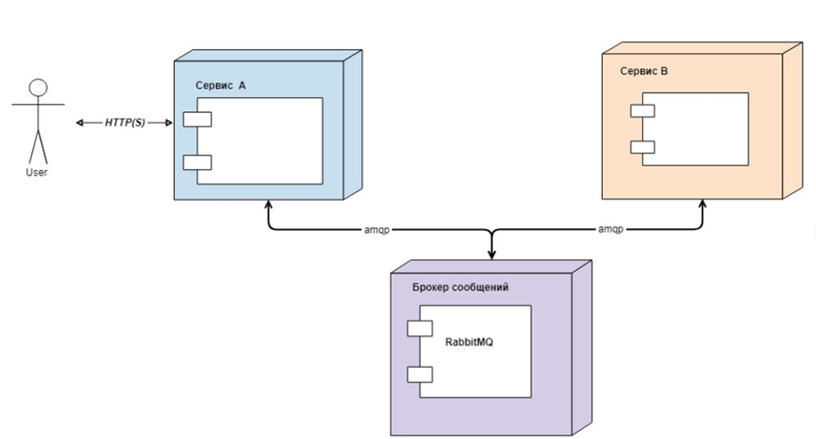

# Задача T4. Составление плана тестирования

## Условие задачи:
- Имеется 2 сервиса: Cервис А и сервис B. Cервис А принимает REST запросы на подключение, отключение и блокирование 
услуги, отсылает amqp сообщение сервису B, который в свою очередь выполняет отключение, подключение услуги и сообщает 
в ответном amqp сообщение результат операции.
- Сервис А принимает запросы и обеспечивает упорядочивание amqp-команд отправляемых на сервис В.
- Cервис А принимает запросы на изменения состояния услуги независимо от результатов взаимодействия с сервисом В. 
Взаимодействие с сервисом B осуществляется в отдельном потоке. Статус услуги изменяется, только после получения 
положительного ответа от сервиса В.
- Сервис А не отправляет следующую команду, пока не получит ответ на предыдущую команду от сервиса B

## Требуется:
Составить план тестирования, верхнеуровнево описать проверяемые тест кейсы.

## План тестирования:

### Юнит-тестирование
- Проверка REST запросов для Сервиса A и Сервиса B изолированно друг от друга.
  - Валидные/невалидные данные в запросах.
  - Корректность ответов на запросы.
  - Изменение статуса услуги после соответствующего запроса.
- Проверка упорядочивания amqp-команд на сервисе A.

### Интеграционное тестирование
- Проверка корректности соединения Сервиса А, брокера сообщений и Сервиса В.

- Проверка запроса от клиента на Сервис А.
- Проверка запроса от Сервиса А к брокеру сообщений.
- Проверка запроса от брокера сообщений на Сервис В.

- Проверка корректности ответа от Сервиса B к брокеру сообщений.
- Проверка корректности ответа от брокера сообщений на Сервис А.
- Проверка корректности ответа от Сервиса А клиенту.

- Проверка повторного запроса от клиента, до обработки первого
- Проверка повторного запроса, после негативного ответа первого
